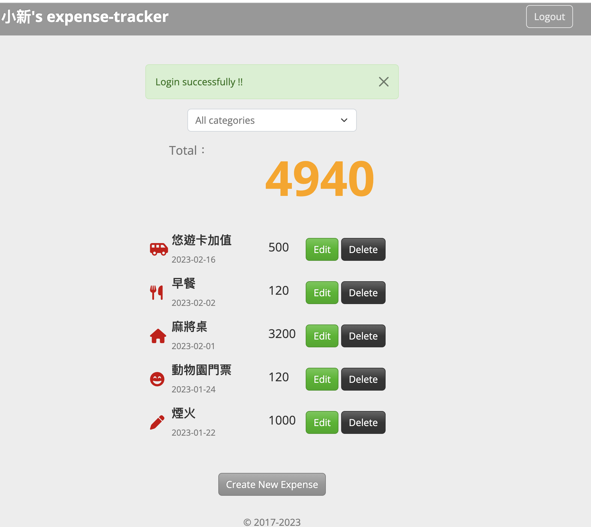
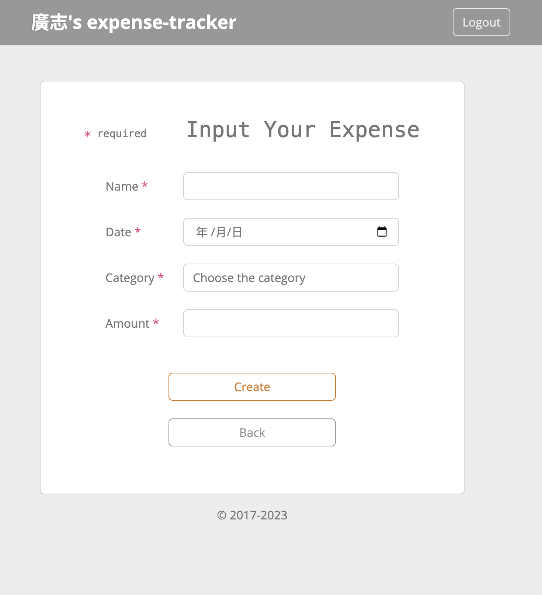

# Expense-tracker





## Introduction

Ths application can help people to record their expense everyday.

## Feature

- Read all record of expense
- Can create a lot of accounts and all of them are independently.
- The record can show what time you do the expense.
- Can add the new record, edit or delete.
- Can sort what you want to know the total amount of expense by the category.
- Support the login of Facebook or Google account

## Package environment

- Node.js@16.18.0 (or lower)
- Express @4.18.2
- Express-handleBars @3.0.0
- Express-session@1.17.3
- nodemon@2.0.20
- Mongoose@6.9.1
- passport@0.6.0
- passport-facebook@3.0.0
- passport-google-oauth20@2.0.0
- passport-local@1.0.0
- bcrypt.js@2.4.3
- Method-override@3.0.0
- dayjs@1.11.7
- dotenv@16.0.3

## How to use

1. Confirm you have already install npm, node.js and express
2. Clone this repository

   ```bash
   https://github.com/wenliangsu/expense-tracker-mongoDB.git
   ```

3. Set the MongoDB

   ```javascript
   MONGODB_URI=mongodb+srv://<Your MongoDB Account>:<Your MongoDB Password>@cluster0.xxxx.xxxx.net/<Your MongoDB Table><?retryWrites=true&w=majority
   ```

4. Then type the command as following:

   ```bash
   npm run seed //if you have the seed
   npm run dev
   ```

5. You will see the message, and copy it into your browser.

   ```bash
   Expense-tracker is listening on localhost: 3000
   ```

### Contributor

***Wen Su***
